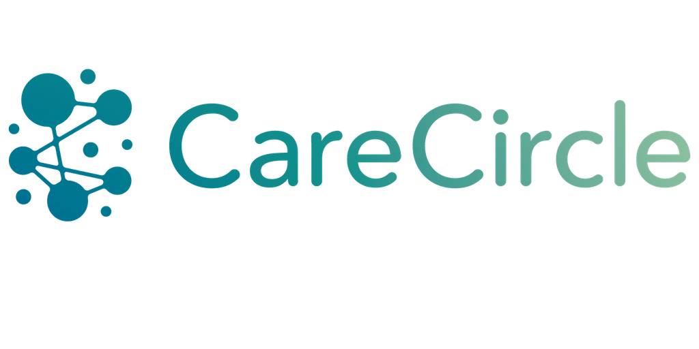
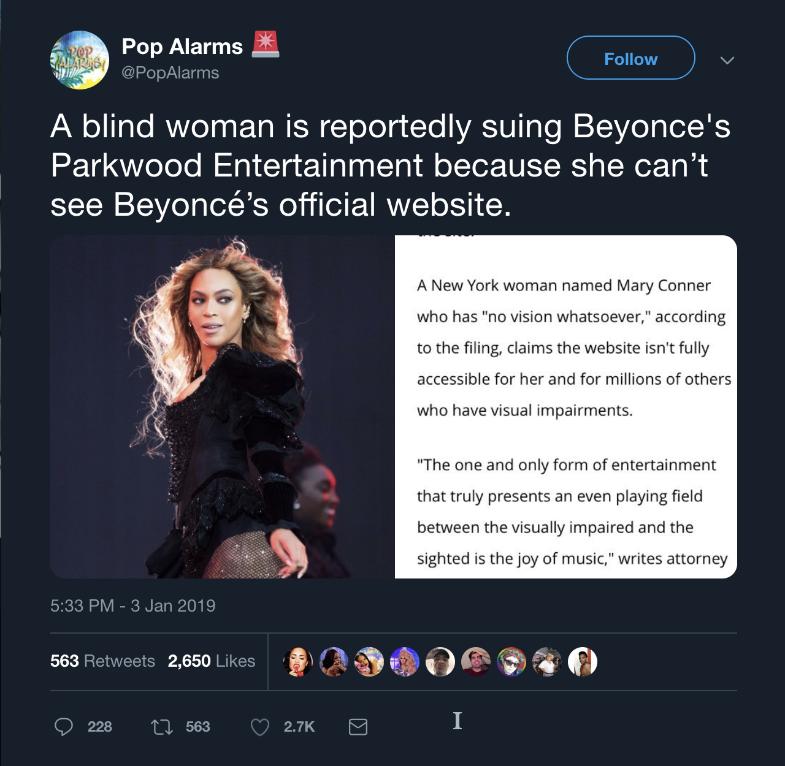
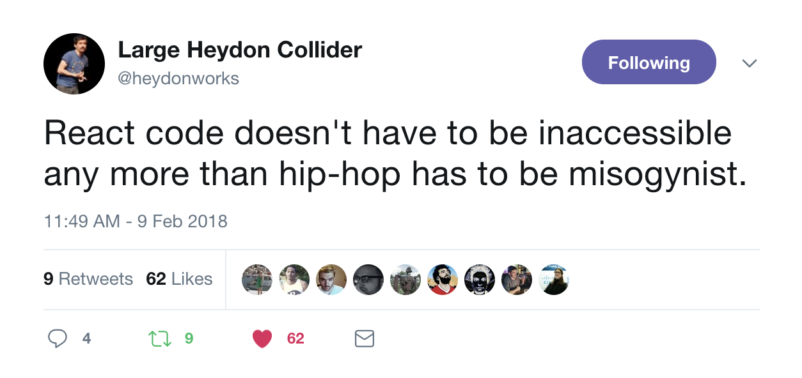
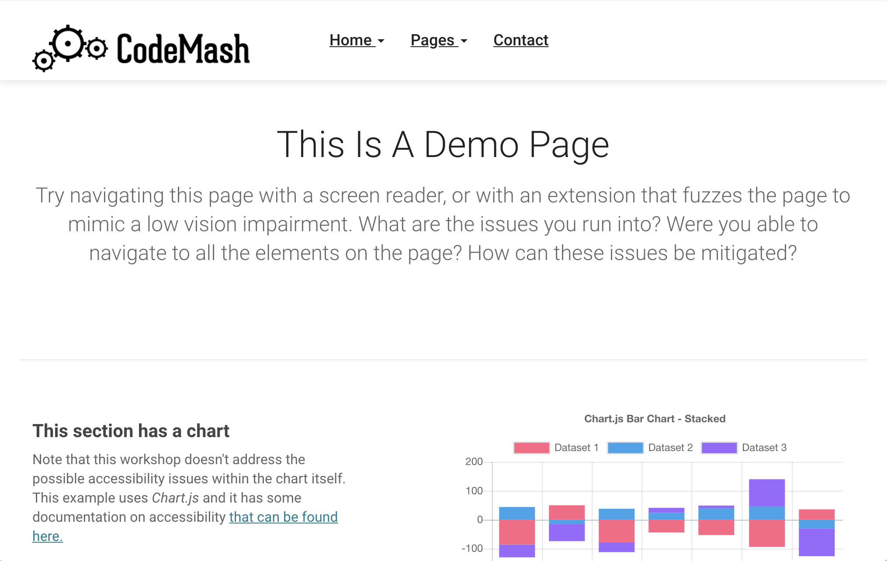
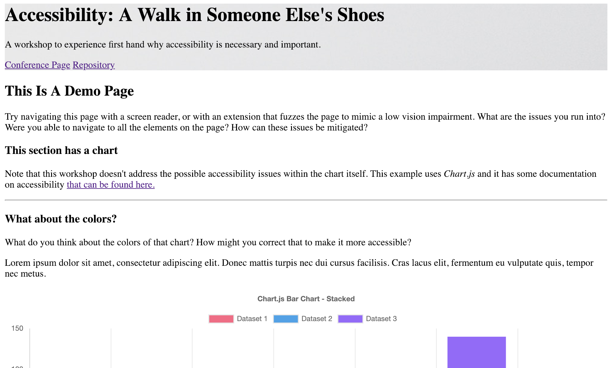
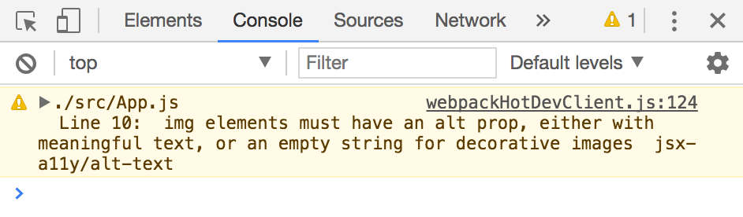
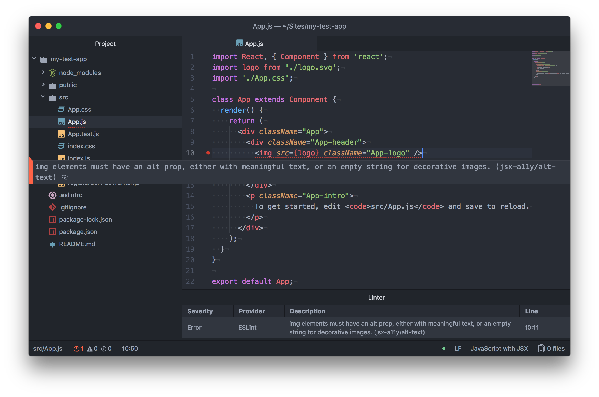
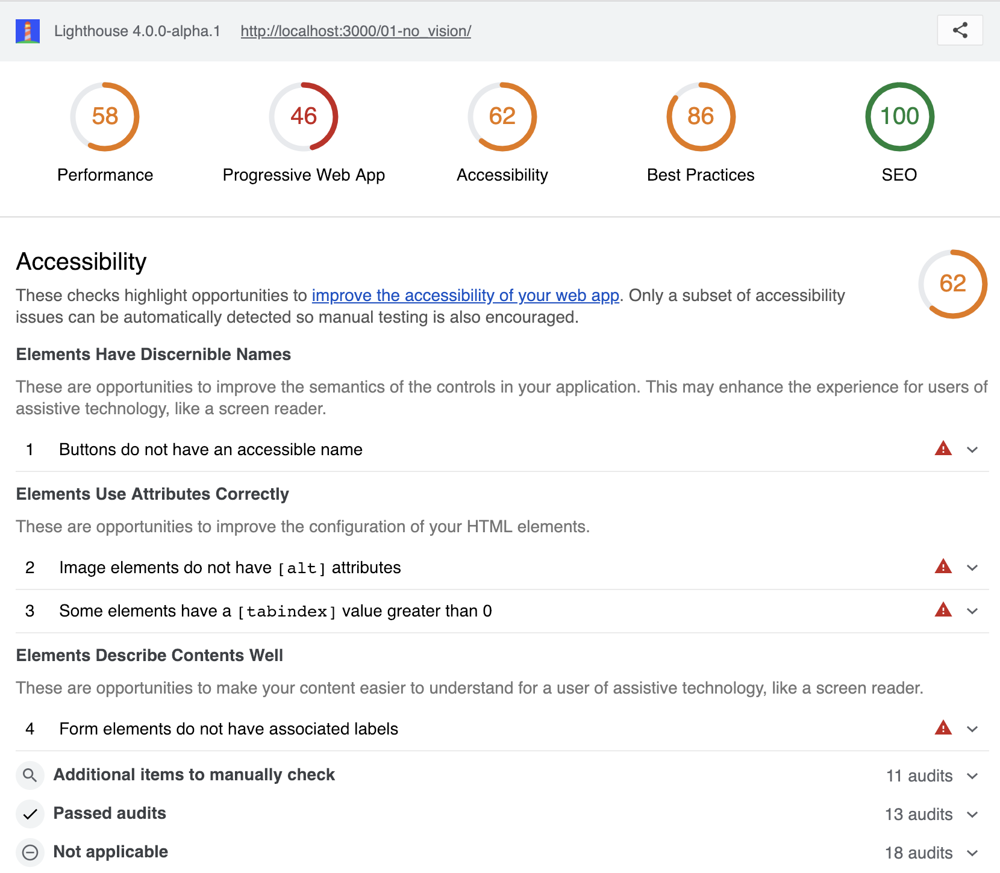
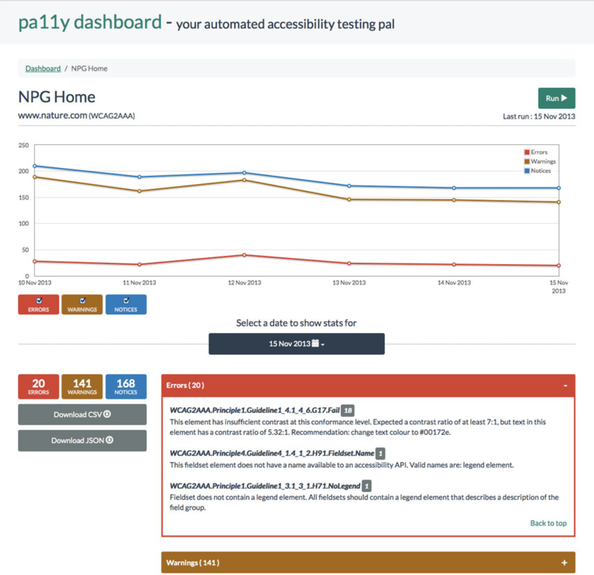
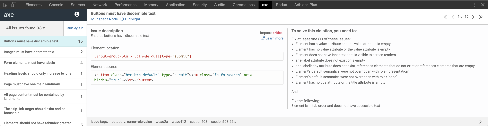

import {
    Appear,
    FullScreenCode,
    Head
} from 'mdx-deck'

export { default as theme } from './Theme'

<Head>
  <title>Be an A11y with React</title>
</Head>

# Be an A11y with React

---

# Poll

```notes
* anyone have a disability?
* anyone have a disability that affects using the web?
* anyone test for accessibility in their apps?
* anyone work for a public agency?
```

---

# Me

<ul style={{ listStyle: 'none', paddingLeft: '0' }}>
    <Appear>
        <li>Senior Application Developer @ OST</li>
        <li>Co-founder/Lead developer @ CareCircle</li>
        <li><a href="https://twitter.com/NathanLoding" style={{ color: 'white' }}>@NathanLoding</a>*</li>
    </Appear>
</ul>  

---



---

# What is "A11Y"

"Accessibility" == "A" + 11 letters + "y"

---

# Why is A11y important?

<ul style={{ listStyle: 'none', paddingLeft: '0' }}>
    <Appear>
        <li>In the United States ...</li>
        <li><strong>1 in 5</strong> Disabled</li>
        <li><strong>8.1 Million</strong> Visually impaired</li>
        <li><strong>2 Million</strong> Blind</li>
        <li><strong>7.6 Million</strong> Auditory impaired</li>
        <li><strong>2.2 Million</strong> Suffer seizures/epilepsy</li>
        <li><strong>19.9 Million</strong> Motor impaired</li>
    </Appear>
</ul>        

---


---



---

# Common disabilities

<ul style={{ listStyle: 'none', paddingLeft: '0' }}>
    <Appear>
        <li><strong>Visual</strong>: color blindness, low vision, blindness</li>
        <li><strong>Cognitive/neuro</strong>: ADHD, Autism spectrum, anxiety, seizures</li>
        <li><strong>Auditory</strong>: hard of hearing, deaf, audio processing</li>
        <li><strong>Physical</strong>: amputation, arthritis, paralysis</li>
        <li><strong>Speech</strong>: muteness, dysarthia, stuttering</li>
    </Appear>
</ul>

---

# [WCAG 2.0](https://www.w3.org/TR/WCAG20/)

---

# POUR

<ul style={{ listStyle: 'none', paddingLeft: '0' }}>
    <Appear>
        <li><strong>P</strong>erceivable</li>
        <li><strong>O</strong>perable</li>
        <li><strong>U</strong>nderstandable</li>
        <li><strong>R</strong>obust</li>
    </Appear>
</ul> 

---



---

# If your site isn't accessible ...

---

# ... it is entirely your fault

---

## It isn't `{{ chosen_framework }}`'s fault ...

---

# Semantic HTML

---


---



---



---

```html
<button class="btn btn-primary"><i class="fa fa-trash"></i></button>
```

becomes

```html
<button class="btn btn-primary"><i class="fa fa-trash"></i> Remove</button>
<button class="btn btn-primary" aria-label="Remove"><i class="fa fa-trash"></i></button>
```

---

```html

```

becomes

```html

```

*_NOT_*

```html


---

```html
<div class="alert alert-danger">This is some text</div>
```

becomes

```html
<div class="alert alert-danger"><i class="fa fa-exclamation"></i> This is some text</div>
```

---

## All of these have one thing in common

---

## They have nothing to do with Javascript or React

---

## JSX outputs the HTML _you_ write

---

# eslint

---

## [eslint-plugin-jsx-a11y](https://github.com/evcohen/eslint-plugin-jsx-a11y)

---



---



---

# `React.Fragment`

---

#### requires React >= 16.0

---

```jsx
class Table extends React.Component {
  render() {
    return (
      <table>
        <tr>
          <Columns />
        </tr>
      </table>
    );
  }
}
```

---

```jsx
class Columns extends React.Component {
  render() {
    return (
      <div>
        <td>Hello</td>
        <td>World</td>
      </div>
    );
  }
}
```

---

```jsx
<table>
  <tr>
    <div>
      <td>Hello</td>
      <td>World</td>
    </div>
  </tr>
</table>
```

---

## Malformed HTML wreaks havoc with accessibility tools

---

```jsx
class Columns extends React.Component {
  render() {
    return (
      <React.Fragment>
        <td>Hello</td>
        <td>World</td>
      </React.Fragment>
    );
  }
}
```

---

```jsx
<table>
  <tr>
    <td>Hello</td>
    <td>World</td>
  </tr>
</table>
```

---

```jsx
class Columns extends React.Component {
  render() {
    return (
      <>
        <td>Hello</td>
        <td>World</td>
      </>
    );
  }
}
```

not all tooling supports this, be sure yours does!

---

```jsx
function Glossary(props) {
  return (
    <dl>
      {props.items.map(item => (
        // Without the `key`, React will fire a key warning
        <React.Fragment key={item.id}>
          <dt>{item.term}</dt>
          <dd>{item.description}</dd>
        </React.Fragment>
      ))}
    </dl>
  );
}
```

---

# Page `title`

---

## When a screen reader begins reading a new page, it often starts with the page title

---

* Helps with SEO!
* Helps visually impaired users with screen readers
* Helps sited users manage their tabs <small>(unless you are like me and have so many tabs open not even the favicon appears)</small>

---

### `document.title`

```jsx
componentDidMount() {
  document.title = 'My page title';
}
```

---

### [react-document-title](https://www.npmjs.com/package/react-document-title)

```jsx
function App() {
  // Use "My Web App" if no child overrides this
  return (
    <DocumentTitle title='My Web App'>
      <SomeRouter />
    </DocumentTitle>
  );
}

function HomePage() {
  // Use "Home" while this component is mounted
  return (
    <DocumentTitle title='Home'>
      <h1>Home, sweet home.</h1>
    </DocumentTitle>
  );
}
```

---

### [react-helmet](https://www.npmjs.com/package/react-helmet)

```jsx
<Parent>
    <Helmet>
        <title>My Title</title>
        <meta name="description" content="Helmet application" />
    </Helmet>
 
    <Child>
        <Helmet>
            <title>Nested Title</title>
            <meta name="description" content="Nested component" />
        </Helmet>
    </Child>
</Parent>
```

---

# Keyboard events

---

## If using `onClick` in an element that isn't typically interacted with ...

---

```jsx
 this.props.callback()} />
```

becomes

```jsx
 event.key === 'Enter' && this.props.callback()} />
```

---

# Focus

---

## Screen readers read what is in focus

---

## When a single page application navigates to a new page, the previously focused DOM content is now entirely gone.

---

## What is in focus?

---


---

```jsx
<div
  ref={
    (loadingMessage) => {
      this.loadingMessage = loadingMessage;
    }
  }
  tabIndex='-1'
  >
  Loading…
</div>
```

---

```jsx
componentDidMount() {
  this.loadingMessage.focus();
}
```

---

## [Reach Router](https://reach.tech/router)

> "Router manages the focus of your app on route transitions. There’s nothing you have to do about it, it just happens."

---

```jsx
import { React } from "react"
import { render } from "react-dom"
import { Router, Link } from "@reach/router"

let Home = () => <div>Home</div>
let Dash = () => <div>Dash</div>

render(
  <Router>
    <Home path="/" />
    <Dash path="dashboard" />
  </Router>
)
```

---

# Live announcements

---

## When an asychronous application fetches new data, screen readers aren't notified of the new data

---

## [ARIA Live Regions](https://developer.mozilla.org/en-US/docs/Web/Accessibility/ARIA/ARIA_Live_Regions)

---

## Roll your own

```jsx
const AriaLiveAnnouncements = ({ message }) => (
    <div aria-live="polite" aria-atomic="true" className="visuallyhidden">
        {message}
    </div>
);

<AriaLiveAnnouncements message={this.state.message} />
```

---

## [react-aria-live](https://www.npmjs.com/package/react-aria-live)

```jsx
<LiveAnnouncer>
  <LiveMessage message={this.state.a11yMessage} aria-live="polite" />
  <button onClick={() => {this.setState({ a11yMessage: 'Button Pressed' });}}>
    Press me
  </button>
</LiveAnnouncer>
```

---

# Testing

---

## Nothing will replace user testing ...

### ... but there are some amazing tools out there ...

---

## WAVE Evaluation Tool


---

## Google Lighthouse extension



---

## <a href="https://tenon.io" target="_blank">Tenon.io</a>

---

## pa11y



---

## Deque aXe



---

# Quick Recap!

<ul style={{ listStyle: 'none', paddingLeft: '0' }}>
    <Appear>
        <li>It's your fault 😳</li>
        <li>Write semantic, structured HTML</li>
        <li>Use <code>eslint-plugin-jsx-a11y</code></li>
        <li>Use <code>React.Fragment</code></li>
        <li>Update the page title</li>
        <li>Manage application focus</li>
        <li>Live announce async changes</li>
        <li>Add accessibility testing to your CI/CD pipeline!</li>
    </Appear>
</ul>  

---

# Thanks for coming!